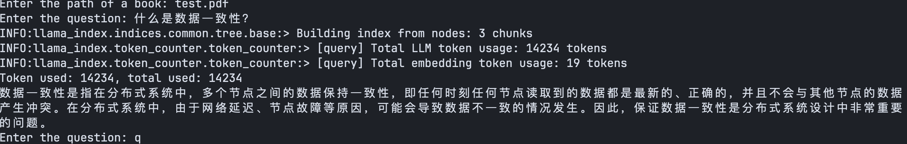
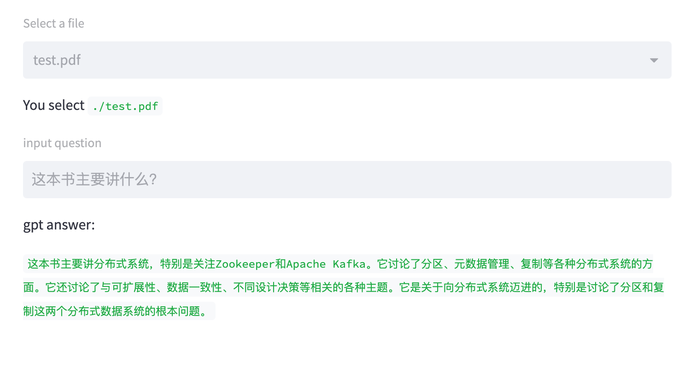

# README

## Intro

this is a demo for gpt reading pdf with llama_index.

## Install dependencies

you need python3.
Then execute the command:

```shell
pip install -r requirements.txt
```

## Usage

1. put the pdfs in this project root path.
2. create a .env file, and set `OPENAI_API_KEY` variable using your openai api key.

you can run `main.py` . It's a CLI.


```shell
python3 main.py
```

or run the streamlit, It's a web app.


```shell
streamlit run streamlit_web.py 
```

have fun!